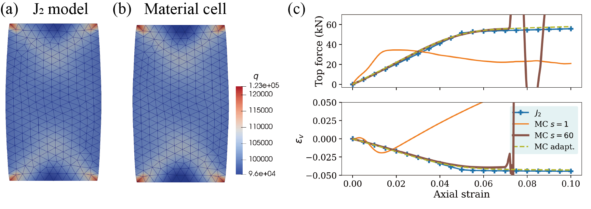

# A network-based material cell for elastoplasticity and its performance in FE analyses of boundary value problems

## The network-based material cell

## Simulation results

----------------------------------------------------
